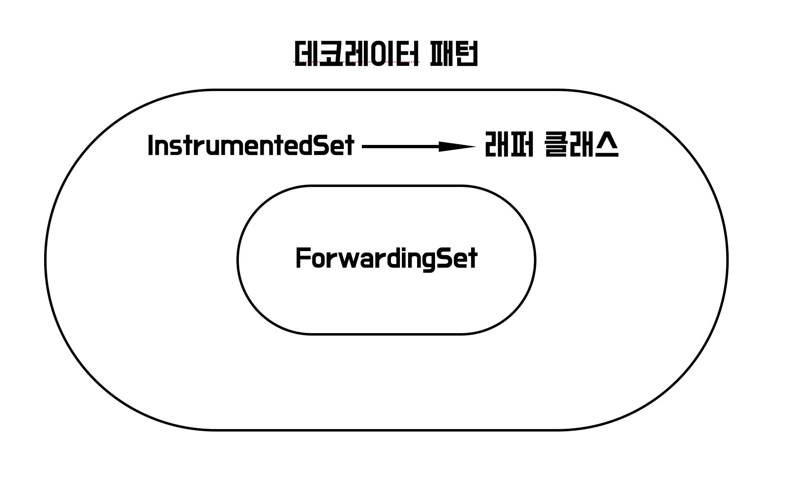

# Item 18. 상속보다는 컴포지션을 사용하라

- 메서드 호출과 달리 상속은 캡슐화를 깨뜨린다. 상위 클래스 변경의 여퍼가 하위 클래스에 영향을 줄 수 있다는 의미이다.
- 상위 클래스 메서드 동작을 다시 구현하는 방식은 어렵고 추가적인 비용이 발생하고 오류를 일으킬 수 있다. 또한 성능적인 문제도 발생할 수 있다.
- 해결 방법은 간단하다. 새로운 클래스를 정의하고 확장하려는 클래스를 내부 참조로 가져가면 된다.

- 래퍼 클래스는 단점이 거의 없다. 자기 자신의 참조를 넘겨서 다음 호출에 사용하는 콜백(callback) 프레임워크와는 어울리지 않는다.
  - 내부 객체가 자신이 감싸고 있는 래퍼를 모르기 때문에 래퍼가 아닌 자신을 넘기게 되기에 발생하는 문제이다. 이러한 문제를 `SELF` 문제라고 한다.

## 상속을 사용할 때

- 클래스 B가 클래스 A와 `is-a` 관계일 때만 상속을 사용해야 한다. 그러기 위해서는 정말 B가 A인지 깊이있게 고민해봐야 한다.
- 컴포지션을 써야 할 상황에서 상속을 사용하는 건 내부 구현을 불필요하게 노출하는 꼴이다.
- 정말 사용하기로 결정했다고 하더라도 API의 `side effect`도 충분히 고려가 필요하다.